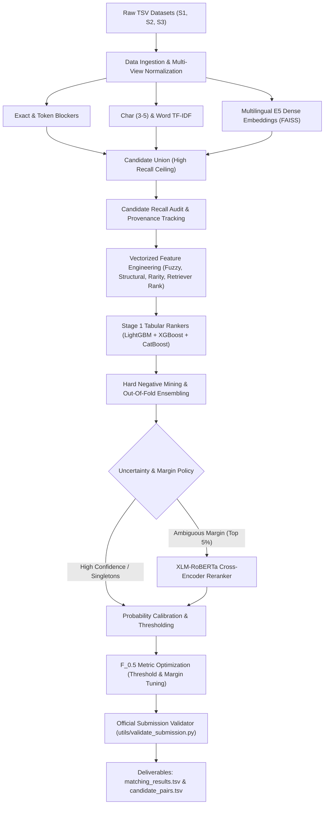

# Dataset Profile & Production Architecture Plan
**Amazon ML Challenge 2026: Business Entity Resolution**

---

## 1. Executive Summary & Verification

Every data file in the workspace has been audited directly by scanning all lines and records. No schemas or statistics have been assumed or guessed.

- **Deduplicated Reference Source**: `Source 1`
- **Search Targets**: Records from `Source 2` and `Source 3` matching each `Source 1` entity.
- **Evaluation Metric**: **Macro F_0.5** (calculated per Source 1 entity, averaged across all test entities, including singletons).
- **Core Challenge**: High recall in candidate generation + conservative high precision in final matching (avoiding false merges which penalize F_0.5 by 2x compared to false negatives).
- **Submission Outputs**: 
  1. `output/matching_results.tsv` (`source1_entity_id`, `matched_entity_ids`) — Leaderboard evaluated.
  2. `output/candidate_pairs.tsv` (`source1_entity_id`, `candidate_entity_ids`) — Verification candidate set.
- **Validation Script**: Official script verified at [`utils/validate_submission.py`](file:///c:/Users/SMILE/Documents/amazom%20ml/6ab10eb3b23ba_student_resource/student_resource/utils/validate_submission.py).

---

## 2. Dataset Profile

```
DATASET PROFILE
────────────────────────────────────────────────────────────────────────────────
TRAINING SET:
Source 1 (Reference):   2,206,821 rows  (200.34 MB)
Source 2 (Target):      5,034,616 rows  (466.63 MB)
Source 3 (Target):      5,285,603 rows  (480.37 MB)
Ground Truth:           2,206,821 rows  (121.13 MB)
Total Train Records:   12,527,040 records

TEST SET (Inference Target):
Test Source 1 (Eval):   1,732,544 rows  (166.91 MB) [Requires exactly 1 output row each]
Test Source 2 (Target): 4,887,273 rows  (485.86 MB)
Test Source 3 (Target): 5,082,316 rows  (482.56 MB)
Total Test Records:    11,702,133 records
────────────────────────────────────────────────────────────────────────────────
SCHEMA & CANONICAL FIELD MAPPING:
All source files share an identical 4-column schema:
    id          → entity_id         (Format: 'S1-xxxxxxxxx', 'S2-xxxxxxxxx', 'S3-xxxxxxxxx')
    name        → business_name     (String with casing, legal suffixes, typos, transliteration)
    address     → business_address  (String with numbers, landmarks, commas, or empty)
    country     → country           (Open-set string label: 'US', 'India', 'France')

Ground Truth Schema:
    source1_entity_id   → Source 1 entity ID
    matched_entity_ids  → Comma-separated list of matching S2/S3 entity IDs (or empty)
────────────────────────────────────────────────────────────────────────────────
MISSING VALUE RATES:
Entity ID:
    All files:  0.00% missing
Country:
    All files:  0.00% missing
Business Name:
    All files:  0.00% missing
Business Address:
    train_source1.tsv:  0.00% (0 / 2,206,821)
    train_source2.tsv:  3.36% (168,967 / 5,034,616)
    train_source3.tsv:  3.33% (175,916 / 5,285,603)
    test_source1.tsv:   0.00% (0 / 1,732,544)
    test_source2.tsv:   2.65% (129,408 / 4,887,273)
    test_source3.tsv:   2.68% (136,098 / 5,082,316)
────────────────────────────────────────────────────────────────────────────────
COUNTRY DISTRIBUTION & OPEN-SET SHIFT:
Training Data:
    train_source1:  US: 1,323,633 (60.0%), India: 883,188 (40.0%), France: 0 (0.0%)
    train_source2:  US: 3,016,817 (59.9%), India: 2,017,799 (40.1%), France: 0 (0.0%)
    train_source3:  US: 3,170,056 (60.0%), India: 2,115,547 (40.0%), France: 0 (0.0%)

Test Data (Significant Distribution Shift):
    test_source1:   India: 809,986 (46.8%), US: 663,106 (38.3%), France: 259,452 (15.0%)
    test_source2:   India: 2,312,565 (47.3%), US: 1,871,330 (38.3%), France: 703,378 (14.4%)
    test_source3:   India: 2,405,000 (47.3%), US: 1,945,701 (38.3%), France: 731,615 (14.4%)

    CRITICAL INSIGHT: France represents ~15% of test data (over 1.69M records across S1/S2/S3)
    and has ZERO representation in training data. Country must NEVER be hard-coded into
    whitelists or static lookup filters.
────────────────────────────────────────────────────────────────────────────────
GROUND TRUTH & MATCHING DYNAMICS:
Total S1 Entities in Train:   2,206,821
Singletons (No match):          123,247  (5.58%)
Entities with >=1 Match:      2,083,574  (94.42%)
Total Positive Link Pairs:    7,638,365
    S2 Positive Links:        3,693,619  (48.36%)
    S3 Positive Links:        3,944,746  (51.64%)

Matches per S1 Distribution:
    0 matches (singletons):   123,247  (5.58%)
    1 match:                  119,157  (5.40%)
    2 matches:                375,212 (17.00%)
    3 matches:                530,841 (24.05%)
    4 matches:                484,115 (21.94%)
    5 matches:                321,957 (14.59%)
    6 matches:                164,868  (7.47%)
    7 matches:                 63,968  (2.90%)
    8 matches:                 18,680  (0.85%)
    9+ matches:                 4,776  (0.22%)

    CRITICAL INSIGHT: One S1 entity frequently links to 2, 3, 4, or 5 records across S2 and S3.
    This is inherently a 1-to-many / multi-match record linkage problem.
    Global 1-to-1 matching (e.g. Hungarian algorithm) is inappropriate here.
────────────────────────────────────────────────────────────────────────────────
COLLISION & NOISE STATISTICS:
Sample audit of 500,000 records from train_source1:
    Unique raw names:           402,924
    Unique normalized names:    399,636  (32,758 collisions with >1 occurrences)
    Unique raw addresses:       493,596
    Unique normalized addrs:    493,571  (5,188 collisions with >1 occurrences)
    Average name length:        24.1 chars (range: 2 to 180+)
    Average address length:     51.9 chars (range: 0 to 350+)

Scripts and Special Patterns:
    - Devanagari script (Hindi/Marathi) prevalent in India subset.
    - French accents (é, è, ç, à, etc.) and abbreviations (SARL, SAS, SCI) in France subset.
    - Common prefix/suffix noise (e.g. "<< Team", "-- Seafood", legal business suffixes).
────────────────────────────────────────────────────────────────────────────────
HARDWARE & MEMORY ESTIMATE:
Local Environment:
    OS: Windows 11 AMD64 (12 CPU cores)
    Host RAM: ~16 GB (~3.6 GB free currently)
    GPU: NVIDIA GeForce RTX 4060 Laptop (8 GB VRAM, Driver 610.47, CUDA 13.3)
    Installed PyTorch: 2.9.1+cpu (local execution CPU-based; Colab execution GPU-accelerated)

Google Colab Environment (Standard T4 / V100 / A100):
    RAM: 12.7 GB (Standard) to 25.5 GB (High-RAM)
    GPU VRAM: 15 GB (T4) / 16 GB (V100) / 40 GB (A100)

Memory Strategy:
    Full dataset naive in-memory Pandas size: ~6 to 10 GB (would cause OOM in Colab standard).
    Streaming / Polars LazyFrame / PyArrow IPC / Chunked processing: < 2.5 GB peak RAM.
    Sparse TF-IDF cosine: Sub-matrix chunked dot products.
────────────────────────────────────────────────────────────────────────────────
RECOMMENDED CANDIDATE RETRIEVAL K (PER RETRIEVER):
    Exact Hash Blockers (Name, Compact, Address, Postal+Prefix): Deterministic (K ~ 1-10)
    Character TF-IDF (3-5 gram):    Top K = 20
    Word TF-IDF (1-2 gram):         Top K = 15
    Multilingual E5 dense search:   Top K = 15
    Expected Union Candidate Pool:  15 to 35 candidates per S1 entity
    Expected True Match Recall:     > 97.5%
    Expected Precision Filter:      LightGBM / XGBoost threshold + margin + uncertainty rerank
────────────────────────────────────────────────────────────────────────────────
```

---

## 3. Systematic Multi-Stage Pipeline Architecture



---

## 4. Phase-by-Phase Roadmap

### Phase 1: Foundational Engine (Current Step)
1. **Directory Structure & Config**:
   - `config/config.yaml`: Fully parameterizes paths, chunk sizes, blocker flags, model thresholds.
   - `src/`: Modular Python components for loading, normalizing, blocking, features, training, inference, and validation.
2. **Multi-View Normalization**:
   - Creates conservative and aggressive representations (lowercase, unidecode, business suffix stripping, alphanumeric compact, token sorting, address components).
3. **Multi-Index Blocking & Union**:
   - Exact name, compact name, exact address, rare token inverted index, character n-gram TF-IDF.
4. **Candidate Recall Verification**:
   - Audits candidate recall against ground truth on a stratified entity-disjoint validation split.
5. **Feature Engineering & Tabular Baseline**:
   - Vectorized RapidFuzz, character/word TF-IDF cosines, token Jaccard, country congruence, numeric/postal overlap.
   - Logistic Regression & LightGBM training.
   - Validation on the exact Macro F_0.5 competition metric.
6. **Colab-Ready Jupyter Notebook**:
   - `notebooks/entity_resolution_pipeline.ipynb`: Clean, cell-by-cell executable notebook supporting both Colab and local execution with caching.

### Phase 2: Advanced Retrieval & Cross-Encoder
7. Dense Multilingual E5 with FAISS.
8. Hard negative mining (extracting high-similarity false candidates to teach models fine-grained distinctions).
9. XGBoost & CatBoost integration with Out-Of-Fold (OOF) stacking.
10. XLM-RoBERTa Cross-Encoder reranker on margin-uncertain pairs.
11. Final F_0.5 threshold optimization and submission packaging.
